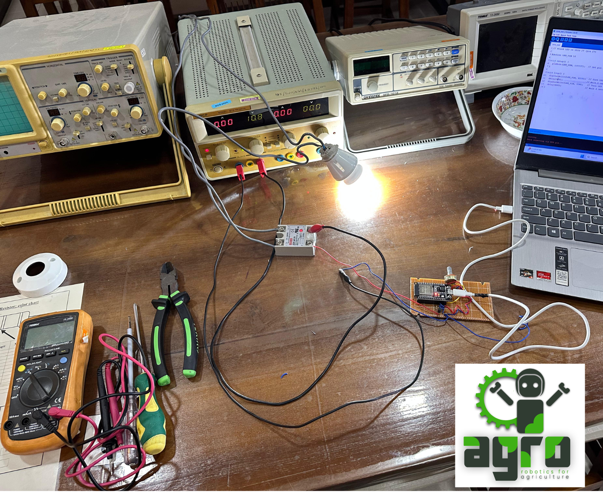
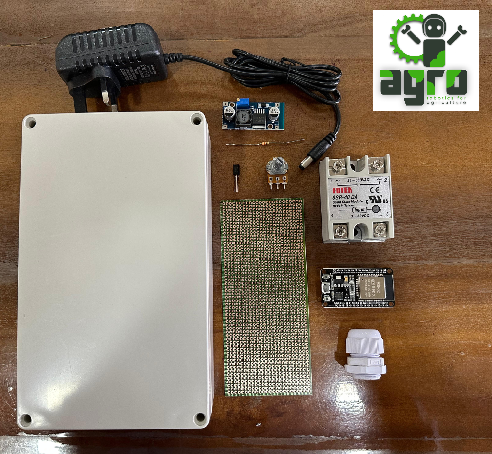

# 🌿 AgRo – Pest Repellent Light Controller Unit

## Simple Technology Solving a Common Farming Problem

Night-time pest attacks are a major challenge for many Sri Lankan farmers, especially in **brinjal and vegetable cultivation**. Instead of relying heavily on chemical pesticides, this project presents a **simple, affordable, and effective electronic solution**.

The **AgRo Pest Repellent Light Controller Unit** uses controlled light-blinking patterns to disrupt pest activity above farmland, supporting **organic and sustainable agriculture**.

---

## 🚜 Project Overview

This unit is designed as a **practical, low-cost embedded system** suitable for real farm environments.  
Rather than complex automation, it focuses on **reliability, simplicity, and ease of deployment**.

---

## ⚙️ System Components

- **ESP32 Microcontroller**  
  Controls programmable light-blinking timing patterns.

- **Solid State Relay (SSR)**  
  Enables safe and reliable switching of AC lamps.

- **Power Supply Module**  
  Compact and stable power solution for outdoor agricultural use.

- **Weather-Resistant Enclosure**  
  Protects electronics from dust, moisture, and insects.

---

## 🧪 Prototype Testing Setup

The following image shows the laboratory testing setup used to verify timing accuracy, switching reliability, and system stability:

---

## 🧩 Hardware Components Used

All major components used in the system are shown below:

**Included parts:**
- ESP32 development board  
- SSR (AC load switching)  
- DC power adapter  
- Voltage regulator module  
- Perfboard and connectors  
- Cable gland & enclosure  

---

## 🔌 Assembled Controller Unit

The fully assembled pest repellent controller unit, ready for field deployment:

---

## 🔦 Field Deployment & Operational Test

The image below shows the Pest Repellent Light Controller Unit in actual operation, connected to an AC lamp and powered from the mains supply.
This setup demonstrates the system’s readiness for real farm environments, where it can be installed near crop fields and operated continuously during night-time hours.

- Highlights from this setup:
- Fully enclosed, weather-resistant control unit
- Safe AC lamp switching using Solid State Relay (SSR)
- Simple plug-and-play installation
- Suitable for outdoor and semi-outdoor agricultural use

.png)

## 🔄 Working Principle

1. ESP32 generates programmable ON/OFF timing signals  
2. SSR switches AC lamps according to the blinking pattern  
3. Blinking light disrupts pest movement and feeding behavior  
4. System runs continuously with minimal maintenance  

---

## 🌱 Key Features

- Low-cost and farmer-friendly design  
- Reduces dependence on chemical pesticides  
- Supports organic and sustainable farming  
- Simple installation and operation  
- Designed and tested for Sri Lankan agricultural conditions  

---

## 🛠️ Technology Stack

- ESP32 (Embedded Firmware)
- Embedded C / Arduino Framework
- Solid State Relay (AC Switching)
- Basic Power Electronics

---

## 👨‍🔧 Developed By

**AgRo – Robotics for Agriculture**  
A technology-driven initiative focused on solving real agricultural problems in Sri Lanka using practical engineering solutions.

---

## 🇱🇰 Vision

> *Simple technology, when applied correctly, can create meaningful impact for farmers.*

---

## 🚀 Future Improvements

- Solar-powered version  
- Configurable blinking profiles for different crops  
- Mobile or web-based control interface  
- Extended field testing across crop varieties  

---

## 📄 License

This project is shared for **educational and research purposes**.  
Commercial use requires prior permission from the AgRo team.
